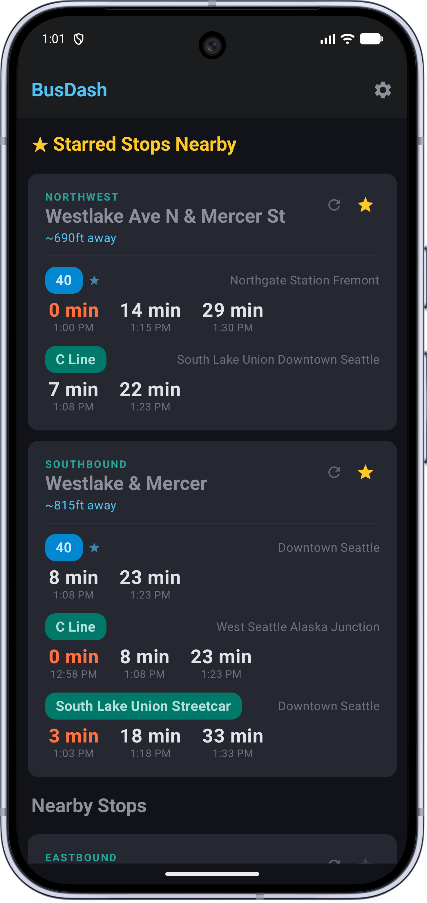
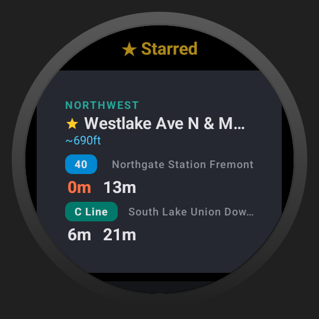
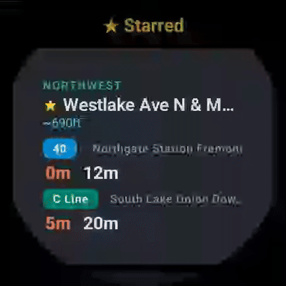

# BusDash

A fast, glanceable transit dashboard for Android and Wear OS. Built for daily commuters who take the same bus from the same stops every day.

Powered by the [OneBusAway API](https://onebusaway.org/).

## Demo

<table>
  <tr>
    <td></td>
    <td></td>
    <td align="center">
      <br>
      
    </td>
  </tr>
  <tr>
    <td align="center">Phone</td>
    <td align="center">Phone</td>
    <td align="center">Wear OS</td>
  </tr>
</table>

## What it does

BusDash shows real-time arrivals for your nearby stops. Star the stops you care about and they float to the top. Open the app, see your bus times, put your phone away. That's it.

Unlike the full OneBusAway app, BusDash is not a trip planner or a transit map. It's a dashboard — optimized for the "when's my bus?" check you do twice a day.

## Features

- Real-time arrivals from OneBusAway
- Star stops for quick access
- Location-aware — shows nearby stops automatically
- Wear OS companion app syncs starred stops from your phone
- Dark theme throughout
- Handles API rate limits gracefully with caching

## Project structure

```
app/    — Android phone app
wear/   — Wear OS app
```

## Building

Standard Android Gradle project. Open in Android Studio, sync, run.

You'll need a OneBusAway API key in your configuration.

### Testing Wear OS Performance

When testing the Wear OS app, **always deploy the `release` build variant** to gauge true real-world scrolling performance. Jetpack Compose lists on Wear OS heavily rely on R8 code minification and optimizations which are disabled in debug mode.

To deploy the optimized release build directly from Android Studio:
1. Open the **Build Variants** tool window (found on the bottom-left edge, or via **View > Tool Windows > Build Variants**).
2. Locate the row for the `wear` module.
3. Click the dropdown under **Active Build Variant** and change it from `debug` to `release`.
4. Click **Run** normally. (The project's `build.gradle.kts` is pre-configured to use the standard debug signing keys for local release builds to make this frictionless).
